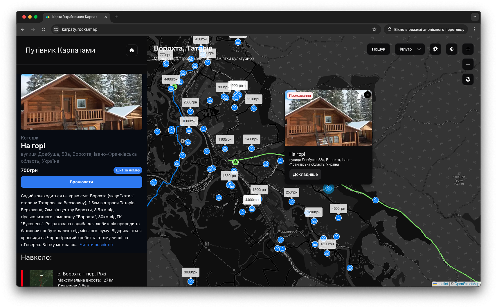

# Karpaty rocks Map

An interactive map that shows hotels, culture places, mountains, trails in the UA

https://karpaty.rocks/map

## Table of Contents

- [Technologies Used](#technologies-used)
- [Local Development](#local-development)

## Technologies Used

- React
- Next JS
- Zustand
- Leaflet | React Leaflet

## Local Development

1. Step 1 - Install dependencies
```bash
$ yarn install
```
2. Step 2 - Add env variables
   - Create a .env.local file in the root directory
   - Add ```KARPATY_ACCESS_TOKEN=``` variable
   - Add ```MAPBOX_ACCESS_TOKEN=``` variable
   - Add ```NEXT_PUBLIC_FOLDER=/``` variable

1. Step 3 - Run development server
```bash
$ yarn dev
```

## Screenshot

